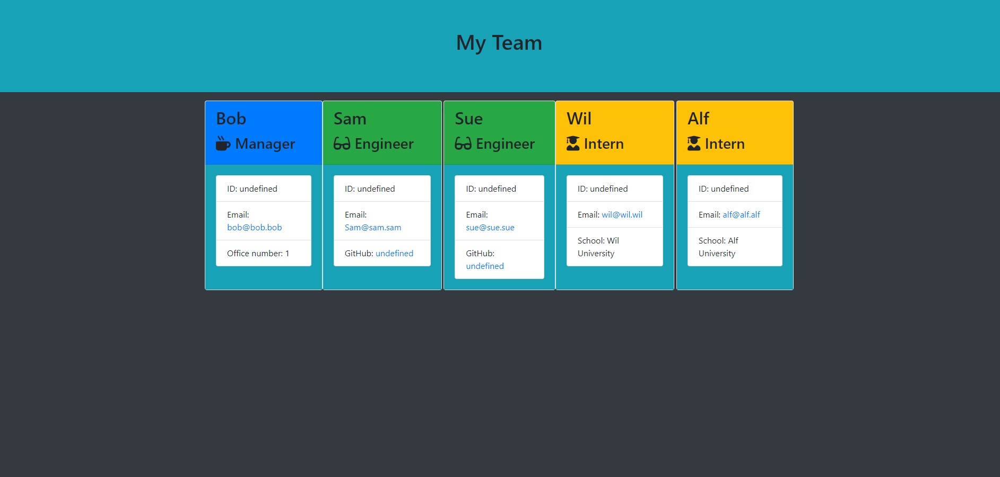
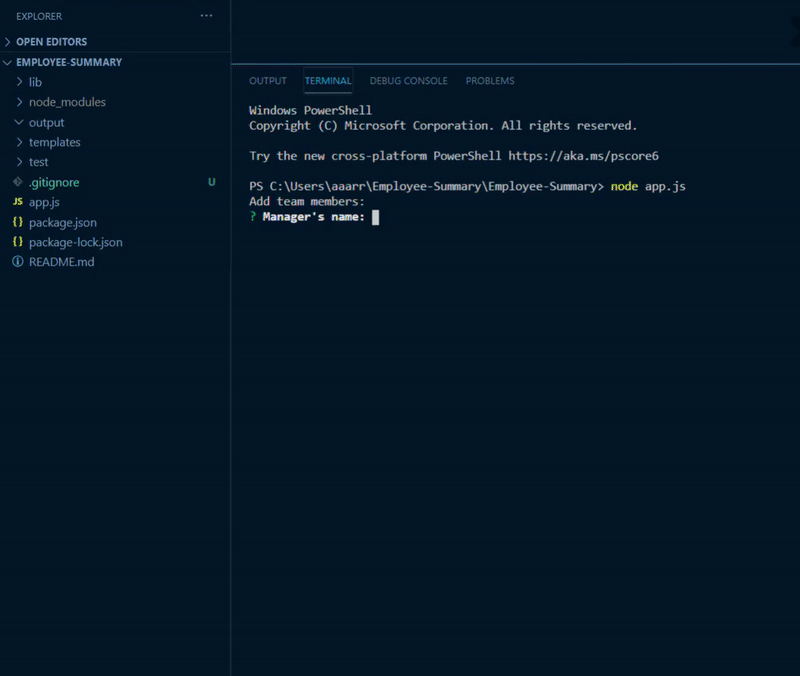

# Employee-Summary

# Application:
Employee-Summary

## Description:
Employee-Summary

## Table of Contents:
  [Image](#image)

  [Gif](#gif)

  [Intallation](#installation)

  [Instructions](#instructions)  

  [License](#license)  

  [Contributing](#contributing)  

  [Tests](#tests)  

  [Questions](#questions)  

## Image:

## Gif:

## Installation:
npm install

## Instructions:
Follow the prompts to create a manager, then as many engineers and interns as needed.

## License:
None

## Contributing Information:
Contact author.

## Tests:
npm test

## Questions:

If you have any questions, open an issue or contact author.

